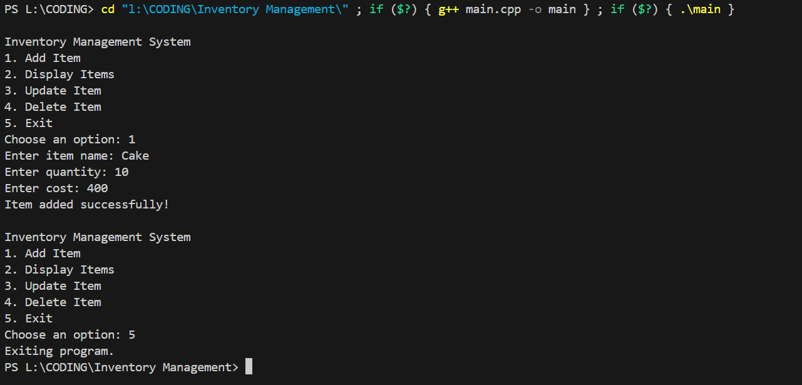

# Inventory Management System

A simple console-based **Inventory Management System** built with C++. This project allows users to manage inventory items by adding, viewing, updating, and deleting records. It’s designed to help users track inventory details such as quantity, item name, and cost, making it an ideal project for practicing data handling and object-oriented programming in C++.

## Features

- **Add Item**: Allows users to add new items to the inventory, specifying name, quantity, and cost.
- **Display Items**: Displays all current inventory items in a structured table format.
- **Update Item**: Enables modification of item quantity or cost by specifying the item ID.
- **Delete Item**: Deletes an item from the inventory based on its unique ID.

## Output



---

## Setup and Usage

1. **Clone the Repository**:
   ```bash
   git clone https://github.com/your-username/inventory-management-system.git
   cd inventory-management-system
